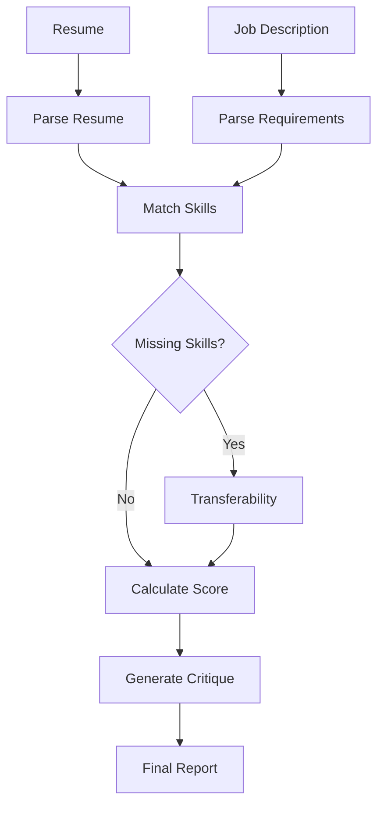

# Techie With Beard AI Lab 🧠

A hands-on AI/ML experimentation workspace focused on building practical, production-oriented applications with **Python, LLMs, LangChain, LangGraph, RAG, local models, vector databases, Pydantic, and Streamlit**.

This repository documents my journey of experimenting with AI application architecture, structured LLM workflows, local model execution, evaluation, observability, and performance optimization.

---

## 🚀 Current Projects

### 1. Resume Analyzer & RAG Application

A Streamlit-based Resume Analyzer that allows users to:

- 📄 Upload a PDF resume
- 🔍 Extract and chunk document content
- 🧠 Generate embeddings using Ollama
- 🗄️ Store embeddings in Chroma
- 🔎 Retrieve relevant resume sections using semantic similarity
- 🤖 Ask questions about the uploaded resume
- 📦 Generate structured responses using Pydantic models
- 🔗 Work with external profile information as the project evolves

### Resume Analyzer Architecture


---

### 2. AI Job Match Analyzer

A **LangGraph-powered workflow** that compares a candidate's resume against a job description.

The workflow currently:

- 📄 Parses the candidate's resume
- 💼 Extracts job requirements
- 🛠️ Matches candidate skills against required skills
- ⚠️ Identifies missing skills
- 🔄 Analyzes transferable skills
- 📊 Calculates candidate fit scores
- 📝 Generates an AI-powered critique
- 🧩 Uses conditional LangGraph routing based on missing skills
- 📦 Uses Pydantic models for structured LLM output

### Job Match Workflow



---

## Sample Response

```json
{
  "candidate_name": "VISHNU THANKAPPAN",
  "candidate_skills": [
    "Angular",
    "Nx",
    "TypeScript",
    "JavaScript",
    "HTML",
    "CSS",
    "SCSS",
    "Design Systems",
    "Modular UI Architecture",
    "NgRx",
    "Jasmine",
    "Karma",
    "Cypress",
    "Playwright",
    "Git",
    "CI/CD",
    "Azure",
    "Storybook",
    "REST APIs",
    "Webpack",
    "Ionic",
    "Xamarin",
    "Agile/Scrum",
    "Distributed Teams",
    "Power Apps",
    "Power Platform"
  ],
  "candidate_experience": [
    "Experience(title='Senior Frontend Engineer', company='Parnasoft Technologies — Client: AVEVA', duration=None, responsibilities=[])",
    "Experience(title='Expert Frontend Engineer', company='Maistering B.V.', duration=None, responsibilities=[])",
    "Experience(title='Frontend Specialist', company='ACI Logistics', duration=None, responsibilities=[])"
  ],
  "required_skills": [
    "Javascript",
    "HTML/CSS",
    "Web Development",
    "Advanced Programming Skills",
    "Modern frameworks (Angular, Ember, React)",
    "Debugging tools (Chrome Dev Tools)",
    "Python",
    "Java",
    "C/C++",
    "C#",
    "Objective-C",
    "Ruby",
    "Expert-level knowledge of Ember",
    "Knowledge of current trends and best practices in front-end architecture (performance, accessibility, security, usability)",
    "Exposure to Android or IOS development"
  ],
  "required_experience": [
    "BA/BS in Computer Science or related technical field or equivalent practical experience",
    "12+ years of industry experience in front-end software design, development, and algorithm related solutions",
    "12+ years programming experience in languages such as Javascript, HTML, CSS, Python, Java, C/C++, C#, Objective-C, Ruby, etc.",
    "Experience writing clean JavaScript including experience with modern frameworks (Angular/Ember/React) and debugging tools (Chrome Dev Tools, etc.)",
    "Prior experience building public API's with Java (Preferred)",
    "Experience building large-scale consumer facing products (Preferred)"
  ],
  "responsibilities": [
    "Own the front-end development for one or more products.",
    "Collaborate with visual/interaction designers, other engineers, and product managers to launch new products, iterate on existing features, and build a world-class user experience.",
    "Implement cutting-edge technologies and write state-of-the-art code.",
    "Ensure the site is delightful, secure, performant, and accessible to all members.",
    "Meet with colleagues including product managers, designers, and other engineers assigned to projects.",
    "Provide architectural guidance and mentorship to up-level the engineering organization.",
    "Develop best practices and define best strategies for craftsmanship.",
    "Act as a role model and professional coach for engineers.",
    "Identify, leverage, and successfully evangelize opportunities and collaborate with cross functional teams to design and build scalable platforms/products/services/tools and to improve engineering productivity in the organization.",
    "Work with peers across teams to support and leverage a shared technical stack.",
    "Resolve conflicts between teams within the organization to get alignment and build team culture.",
    "Review others' work and share knowledge."
  ],
  "matching_skills": [
    "Javascript",
    "HTML/CSS",
    "Web Development",
    "Modern frameworks (Angular, Ember, React)",
    "C#",
    "Exposure to Android or IOS development"
  ],
  "missing_skills": [
    "Advanced Programming Skills",
    "Debugging tools (Chrome Dev Tools)",
    "Python",
    "Java",
    "C/C++",
    "Objective-C",
    "Ruby",
    "Expert-level knowledge of Ember",
    "Knowledge of current trends and best practices in front-end architecture (performance, accessibility, security, usability)"
  ],
  "skill_matches": [
    "SkillMatch(requirement='Javascript', matched=True, evidence=\"The skill 'JavaScript' is explicitly listed in the candidate skills.\", confidence=1.0)",
    "SkillMatch(requirement='HTML/CSS', matched=True, evidence=\"The candidate list explicitly includes both 'HTML' and 'CSS'.\", confidence=1.0)",
    "SkillMatch(requirement='Web Development', matched=True, evidence='The candidate lists core web technologies (HTML, CSS, JavaScript) alongside major frameworks and tools specific to modern web development (Angular, TypeScript, Webpack, Storybook, Design Systems).', confidence=1.0)",
    "SkillMatch(requirement='Advanced Programming Skills', matched=False, evidence=None, confidence=0.95)",
    "SkillMatch(requirement='Modern frameworks (Angular, Ember, React)', matched=True, evidence=\"The candidate explicitly lists 'Angular', which is one of the required modern frameworks.\", confidence=1.0)",
    "SkillMatch(requirement='Debugging tools (Chrome Dev Tools)', matched=False, evidence=None, confidence=0.95)",
    "SkillMatch(requirement='Python', matched=False, evidence=None, confidence=1.0)",
    "SkillMatch(requirement='Java', matched=False, evidence=None, confidence=1.0)",
    "SkillMatch(requirement='C/C++', matched=False, evidence=None, confidence=1.0)",
    "SkillMatch(requirement='C#', matched=True, evidence='Xamarin (A framework that fundamentally requires proficiency in C#)', confidence=0.95)",
    "SkillMatch(requirement='Objective-C', matched=False, evidence=None, confidence=1.0)",
    "SkillMatch(requirement='Ruby', matched=False, evidence=None, confidence=1.0)",
    "SkillMatch(requirement='Expert-level knowledge of Ember', matched=False, evidence=None, confidence=1.0)",
    "SkillMatch(requirement='Knowledge of current trends and best practices in front-end architecture (performance, accessibility, security, usability)', matched=False, evidence=None, confidence=0.95)",
    "SkillMatch(requirement='Exposure to Android or IOS development', matched=True, evidence='Xamarin (A dedicated framework for building native cross-platform applications targeting both iOS and Android)', confidence=1.0)"
  ],
  "transferability": [
    "Transferability(missing_skill='Advanced Programming Skills', related_skills=[], transferability_score=80.0, learning_difficulty='Moderate to High', reasoning=\"The missing skill 'Advanced Programming Skills' is extremely broad and generally refers to deep knowledge of computer science fundamentals (e.g., complex data structures, algorithms, time/space complexity analysis) that go beyond typical framework usage. However, the candidate's profile strongly suggests a high level of conceptual understanding necessary for advanced programming.\\n\\n**Related Skills:** The most relevant skills are **TypeScript**, **JavaScript**, and especially **Modular UI Architecture** and **NgRx**. Implementing complex state management (NgRx) or designing highly modular systems requires more than just knowing syntax; it demands an understanding of data flow, computational efficiency, and architectural patterns. Furthermore, experience with build tools like **Webpack** implies a conceptual understanding of how code is compiled, optimized, and executed—a core advanced programming concept.\\n\\n**Analysis:** The candidate's seniority (Senior/Expert titles) combined with their mastery of complex frontend concepts (like state management and modularity) indicates they have already operated at an advanced level within the web stack. They are not merely a coder; they are an architect who understands *why* certain patterns are used. While we cannot confirm proficiency in general computer science algorithms or low-level languages, their existing foundation is robust enough that transitioning into structured learning (e.g., algorithmic problem sets) would be highly effective.\")",
    "Transferability(missing_skill='Debugging tools (Chrome Dev Tools)', related_skills=['TypeScript', 'JavaScript', 'Angular', 'NgRx', 'Cypress', 'Playwright', 'Webpack', 'Senior Frontend Engineer/Expert Frontend Engineer titles'], transferability_score=95.0, learning_difficulty='Low', reasoning=\"The ability to use advanced debugging tools is not a standalone skill but a fundamental operational requirement for any professional working with modern web frameworks and complex testing suites. The candidate's listed skills and experience strongly imply mastery of these tools.\")",
    "Transferability(missing_skill='Python', related_skills=[], transferability_score=75.0, learning_difficulty='Low to Moderate', reasoning=\"The candidate is an experienced 'Expert Frontend Engineer' who has demonstrated mastery in a complex, high-level programming language (TypeScript/JavaScript). This indicates strong foundational knowledge of core computer science concepts: control flow, data structures, object-oriented principles, and algorithmic thinking. These conceptual skills are highly transferable to any other general-purpose language like Python.\\n\\nThe primary hurdle is not the concept, but the syntax and ecosystem. Python uses a distinct syntax (e.g., indentation for blocks, different function definitions) compared to JavaScript/TypeScript. However, because the candidate has proven experience in complex software development cycles (CI/CD, Angular architecture), they possess the discipline and ability to rapidly learn new syntaxes and paradigms.\\n\\nWhile their current focus is client-side web development, Python's versatility means that learning it for backend scripting or data processing would be a natural extension of their engineering mindset. The transferability score reflects strong conceptual aptitude but acknowledges the necessary effort required to master an entirely new language syntax.\")",
    "Transferability(missing_skill='Java', related_skills=[], transferability_score=65.0, learning_difficulty='Medium to High', reasoning='The candidate possesses strong foundational programming skills demonstrated by their expertise in TypeScript and Angular. Both languages are high-level, object-oriented paradigms, meaning the candidate has a solid grasp of core concepts like classes, inheritance, data structures, control flow, and modular architecture (OOP principles). This conceptual understanding is highly transferable.\\n\\nHowever, Java operates on a different syntax, memory model, and ecosystem (JVM) compared to JavaScript/TypeScript. While the *logic* required for software development is portable, mastering Java requires learning its specific grammar, standard libraries, and typical backend frameworks (e.g., Spring Boot). The transition from a frontend-focused language like TypeScript to an enterprise backend language like Java represents a significant paradigm shift in tooling and architecture.\\n\\n**Conclusion:** The candidate has the intellectual capacity and foundational programming maturity to learn Java. They are not starting from scratch. However, they will need dedicated time to overcome the syntax differences and adapt their architectural mindset from client-side rendering/state management (NgRx) to server-side business logic.')",
    "Transferability(missing_skill='C/C++', related_skills=[], transferability_score=25.0, learning_difficulty='High', reasoning='The candidate possesses a strong background in modern, high-level web development (TypeScript, Angular, JavaScript). These languages operate within managed environments with automatic memory management (garbage collection), abstracting away low-level details like pointers and manual resource allocation. C/C++, conversely, are compiled, low-level languages that require explicit, manual memory management (pointers, stack vs. heap, RAII). While the candidate demonstrates exceptional architectural understanding and problem-solving ability (evidenced by mastering complex frameworks like Angular/Nx and tools like Webpack), the core paradigms of C++ are fundamentally different from those they currently use. The transition requires learning entirely new concepts related to system architecture and memory handling that are orthogonal to their existing expertise. This is a significant paradigm shift, making it challenging but not impossible for an experienced engineer.')",
    "Transferability(missing_skill='Objective-C', related_skills=[], transferability_score=60.0, learning_difficulty='Medium to High', reasoning=\"The candidate's background is heavily rooted in modern, object-oriented web development (Angular/TypeScript). Objective-C is a mature, C-based language primarily used for Apple platform development. The primary transferable skill is the strong grasp of **Object-Oriented Programming (OOP) principles** and structured coding practices demonstrated by their use of Angular, TypeScript, and NgRx.\\n\\nHowever, the transition involves significant conceptual shifts: Objective-C syntax is fundamentally different from JavaScript/TypeScript, requiring familiarity with C-style memory management and pointers. While the candidate has experience with cross-platform frameworks like **Xamarin** (which bridges web concepts to native mobile code), this suggests an openness to non-web development paradigms.\\n\\nThe core challenge is not the concept of OOP, but mastering a specific, older syntax and ecosystem that differs greatly from their current JavaScript/TypeScript environment. This requires dedicated study outside of standard web development practices.\")",
    "Transferability(missing_skill='Ruby', related_skills=[], transferability_score=75.0, learning_difficulty='Moderate-High', reasoning=\"The candidate's profile demonstrates mastery of complex programming paradigms (TypeScript/Angular) and the ability to integrate with backend services via REST APIs. This proves a high aptitude for learning new languages and understanding core computer science concepts (data structures, control flow, OOP principles). Ruby is a general-purpose language that shares fundamental programming logic with JavaScript/TypeScript. The primary challenge is not the concept of programming itself, but the shift in syntax, runtime environment, and ecosystem (from JS/Node.js to Ruby/Rails). Given their 'Expert' level experience across multiple complex stacks, they possess the foundational knowledge required to quickly grasp a new language structure, even if it requires dedicated effort to master the specific idioms of Ruby.\")",
    "Transferability(missing_skill='Expert-level knowledge of Ember', related_skills=[], transferability_score=75.0, learning_difficulty='Moderate', reasoning=\"The candidate has demonstrated deep expertise in mastering large, opinionated, component-based frameworks (Angular). This proves a high capacity for learning complex architectural patterns and specific framework APIs. Ember is fundamentally another JavaScript framework built on similar principles (MVC/MVVM, components, lifecycle hooks). The conceptual transferability is very high.\\n\\nHowever, 'Expert-level' knowledge implies deep institutional understanding of Ember's unique conventions, internal workings, and best practices—knowledge that cannot be assumed simply because the candidate knows Angular. While they can quickly learn the syntax and basic usage, achieving true expert status in a new framework requires dedicated time to absorb its specific paradigms (e.g., data binding, routing structure) which differ significantly from those used in Angular/TypeScript.\\n\\nThe existing skills confirm that the candidate is an advanced practitioner capable of mastering complex technologies, making the learning curve manageable but requiring significant effort to reach expert status.\")",
    "Transferability(missing_skill='Knowledge of current trends and best practices in front-end architecture (performance, accessibility, security, usability)', related_skills=[], transferability_score=80.0, learning_difficulty='Low to Moderate', reasoning=\"This missing skill is a meta-skill—it represents deep industry knowledge rather than a specific technology. The candidate's existing profile demonstrates strong practical experience in implementing modern architectural patterns and development workflows, which are the primary components of this missing skill.\\n\\n**Strengths:** The presence of 'Modular UI Architecture', 'Design Systems', 'Storybook', and 'Nx' indicates that the candidate has already adopted best practices for componentization, reusability, and maintainability. Experience with 'CI/CD', 'Webpack', and 'Azure' suggests familiarity with modern deployment pipelines and build optimization (performance). Furthermore, roles like 'Senior Frontend Engineer' imply exposure to complex, real-world problems requiring architectural decision-making.\\n\\n**Gaps:** While the candidate has implemented these practices, the profile does not explicitly confirm deep theoretical knowledge in specific areas such as advanced WCAG compliance details (Accessibility), or specialized security protocols beyond basic API integration (Security). However, given their seniority and breadth of skills across multiple frameworks (Angular, Ionic, Xamarin) and platforms (Power Platform), they have the conceptual foundation to quickly absorb these best practices through focused study and mentorship. The learning curve is primarily about deepening theoretical knowledge rather than mastering a new technical stack.\")"
  ],
  "experience_score": 100,
  "responsibility_score": 100,
  "overall_score": 70,
  "critique": {
    "strengths": [],
    "weaknesses": [],
    "missing_skills": [],
    "learning_potential": "High",
    "recommendations": [
      "**Proceed to the interview stage.** The candidate possesses deep expertise in modern frontend architecture and has demonstrated mastery of complex, enterprise-level tools (Angular, Nx, Storybook). Their skill set is highly relevant to owning front-end development for large products.",
      "**Interviewer Focus Areas:**",
      "1. **Architectural Depth:** Test their ability to provide architectural guidance and define best practices. Ask scenario-based questions regarding state management optimization (NgRx) or component lifecycle issues in a large, modular system.",
      "2. **Cross-Functional Leadership:** Since the role requires mentoring and resolving team conflicts, assess their communication skills, experience collaborating with Product Managers/Designers, and ability to evangelize technical best practices across teams.",
      "3. **System Design:** Present a complex feature requirement (e.g., building a real-time dashboard) and ask them to outline the entire front-end architecture, including data flow, component breakdown, and testing strategy (Cypress/Playwright).",
      "**Technical Areas to Test:** TypeScript proficiency, Modular UI Architecture implementation, State Management patterns (NgRx), and CI/CD pipeline integration."
    ],
    "overall_assessment": "Strong Candidate - Proceed with Interviewing."
  }
}

```

---

## 🤖 Models

The project currently focuses on running models locally using **Ollama**.

| Purpose | Model |
|---|---|
| Chat / LLM | `gemma4:e4b` |
| Embeddings | `embeddinggemma:latest` |
| Runtime | Ollama |

Running models locally makes experimentation inexpensive and keeps the workflow under local control.

---

## 🧰 Technology Stack

### AI / LLM

- Python
- LangChain
- LangGraph
- Ollama
- Gemma
- Pydantic
- RAG

### Vector Search

- Chroma

### Application

- Streamlit

### Development

- PDM
- Pytest
- Git

---

## 📂 Project Structure

```text
ml/
├── data/
├── artifacts/
├── chroma_db/
├── notebooks/
├── tests/
├── streamlit/
│   ├── Home.py
│   └── pages/
│       └── job_match.py
├── src/
│   └── techiewithbeard_ai/
│       ├── agents/
│       ├── chains/
│       ├── job_match/
│       ├── loaders/
│       └── schema/
├── pyproject.toml
├── pdm.lock
└── README.md
```

---

## ▶️ Running the Streamlit Application

### 1. Install dependencies

This project uses **PDM** for dependency management.

```bash
pdm install
```

Activate the virtual environment if required:

```bash
source .venv/bin/activate
```

### 2. Start Ollama

Make sure Ollama is running locally and the required models are available.

```bash
ollama serve
```

Pull the models if they are not already installed:

```bash
ollama pull gemma4:e4b
ollama pull embeddinggemma:latest
```

### 3. Start Streamlit

From the project root:

```bash
python -m streamlit run streamlit/Home.py
```

The application will be available at:

```text
http://localhost:8501
```

---

## 🧠 What I'm Learning

This repository is not just about building individual AI applications. It is also an exploration of the engineering challenges involved in making LLM applications reliable and production-ready.

Current areas of exploration include:

- LLM application architecture
- RAG pipelines
- LangGraph workflows
- Structured LLM output
- Pydantic validation
- Local LLM inference
- Prompt engineering
- Agentic workflows
- Vector search
- Evaluation
- Observability
- Performance optimization

---

## ⚡ Performance Investigation

The **AI Job Match Analyzer** currently runs entirely using a local Gemma model through Ollama.

The complete workflow currently takes approximately **5 minutes** on my local setup.

This makes performance optimization the next major focus.

I'm currently looking at:

- ⏱️ Identifying slow nodes in the LangGraph workflow
- 🔎 Understanding model inference latency
- 🔁 Reducing unnecessary LLM calls
- 🧩 Improving structured output generation
- 📦 Optimizing prompt size
- ⚡ Exploring parallel execution where possible
- 📊 Adding tracing and observability
- 🧪 Evaluating output quality alongside performance

Tools and approaches I'm exploring include **LangSmith**, evaluation frameworks, and more advanced agentic workflows.

---

## 🔭 Roadmap

- [x] PDF resume extraction
- [x] Resume RAG pipeline
- [x] Local embeddings with Ollama
- [x] Vector search with Chroma
- [x] Structured outputs with Pydantic
- [x] Resume parsing
- [x] Job requirement extraction
- [x] Skill matching
- [x] Missing skill detection
- [x] Transferability analysis
- [x] Candidate scoring
- [x] AI-generated critique
- [x] Conditional LangGraph workflow
- [ ] Improve workflow performance
- [ ] Add LangSmith tracing
- [ ] Add automated evaluation
- [ ] Improve evaluation metrics
- [ ] Experiment with parallel LangGraph nodes
- [ ] Explore agentic workflows
- [ ] Improve UI and visualizations
- [ ] Add LinkedIn profile analysis
- [ ] Deploy the application

---

## 📈 Development Philosophy

> **Build → Measure → Understand → Optimize → Repeat**

The goal is to learn by building real applications rather than only experimenting with isolated models or tutorials.

---

## 🔗 Project

The project is continuously evolving as I experiment with different AI application patterns, models, frameworks, and architectures.

More experiments and improvements will be added over time.

---

## 👨‍💻 Author

**Vishnu Thankappan**

Senior Frontend Engineer | Angular | Nx | AI Interfaces

---

⭐ If you find the experiments useful, feel free to explore the repository and follow along with the progress.
