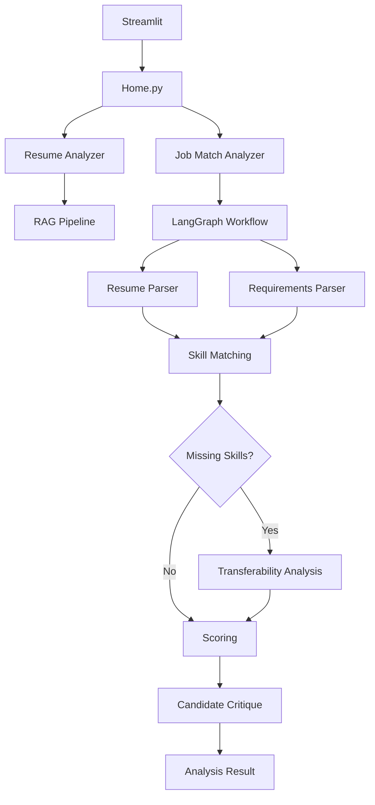
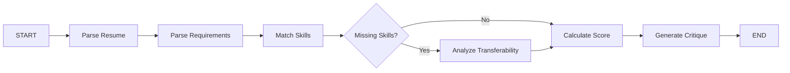

# Streamlit UI 🖥️

This folder contains the **Streamlit frontend** for the AI/ML applications in this project.

The UI provides a simple interface for interacting with the RAG applications and AI-powered resume and job analysis workflows.

## 🚀 Running the Application

From the **project root**, run:

```bash
python -m streamlit run streamlit/Home.py
```

Streamlit will start a local development server, typically available at:

```text
http://localhost:8501
```

## 📁 Structure

```text
streamlit/
├── Home.py
├── pages/
│   └── job_match.py
└── README.md
```

### `Home.py`

The main Streamlit entry point for the application.

It provides access to the different AI/ML applications available in the project.

### `pages/job_match.py`

The **AI Job Match Analyzer** interface.

It allows users to:

- 📄 Upload a candidate resume
- 💼 Enter a job description
- 🧠 Run the LangGraph analysis workflow
- 🔎 Compare candidate skills with job requirements
- ⚠️ Identify missing skills
- 🔄 Analyze skill transferability
- 📊 Calculate candidate scores
- 📝 Generate a candidate critique
- 🕸️ Visualize the LangGraph workflow

## 🧠 Application Flow

The Streamlit UI acts as the presentation layer while the AI workflows are implemented under `src/techiewithbeard_ai/`.

### High-Level Flow



### Job Match Workflow

The Job Match Analyzer is implemented as a graph-based workflow:



## ⚙️ Requirements

Make sure the Python virtual environment is activated before running Streamlit.

### Activate the virtual environment

```bash
source .venv/bin/activate
```

### Install dependencies

The project dependencies are managed through `pyproject.toml` and PDM.

If using PDM:

```bash
pdm install
```

Then run the application:

```bash
python -m streamlit run streamlit/Home.py
```

## 🤖 Local LLM

The application currently supports local LLM execution using **Ollama**.

Make sure Ollama is running before launching the application.

```bash
ollama serve
```

The default Ollama endpoint is:

```text
http://localhost:11434
```

### Current Models

| Purpose | Model |
|---|---|
| Chat / LLM | `gemma4:e4b` |
| Embeddings | `embeddinggemma:latest` |

The local model configuration allows the application to run without relying on a hosted LLM API for the current workflow.

## 🔗 LangGraph Visualization

The Job Match Analyzer exposes the LangGraph workflow directly in the Streamlit UI using Mermaid.

The graph currently represents:

```text
Resume
  ↓
Requirements
  ↓
Skill Matching
  ↓
Missing Skills?
  ├── Yes → Transferability → Scoring
  └── No  → Scoring
                    ↓
                 Critique
                    ↓
                  Result
```

This makes it easier to visualize how individual analysis nodes are connected and how conditional execution is handled.

## 🔬 Development

The Streamlit UI is primarily intended as an **experimentation and demonstration layer** for the AI components under:

```text
src/techiewithbeard_ai/
```

The application is expected to evolve as new AI workflows, agents, RAG pipelines, evaluation experiments, and other AI features are added.

## 📌 Current Status

The **Job Match Analyzer** currently:

- Extracts resume content from PDF files
- Parses candidate information using an LLM
- Extracts technical requirements from job descriptions
- Matches candidate skills against required skills
- Identifies missing skills
- Analyzes transferable skills
- Calculates candidate scores
- Generates a candidate critique
- Visualizes the analysis workflow using LangGraph + Mermaid

## ⚡ Performance

The Job Match Analyzer currently runs locally using:

```text
Ollama
  └── Gemma
```

The complete analysis workflow can currently take **several minutes**, depending on local hardware, model configuration, prompt size, and the number of LLM calls in the workflow.

Performance optimization is currently an active area of development.

The next focus areas include:

- Identifying bottlenecks within the LangGraph workflow
- Profiling individual LLM calls
- Reducing unnecessary model invocations
- Improving prompt efficiency
- Exploring parallel execution where appropriate
- Reducing latency between graph nodes
- Evaluating model configuration and token limits
- Measuring end-to-end workflow performance

## 🧪 Experimentation

This project is intentionally being developed as an AI/ML learning and experimentation workspace.

Some of the areas being explored include:

- LangChain
- LangGraph
- RAG
- Local LLMs
- Ollama
- Structured output
- Pydantic
- Vector databases
- Semantic search
- Streamlit
- AI agents
- Evaluation and performance optimization

The goal is to gradually move from experimentation toward **more reliable and production-oriented AI workflows**.
